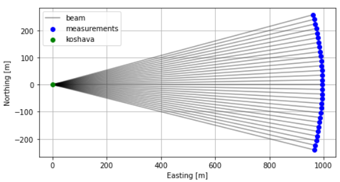
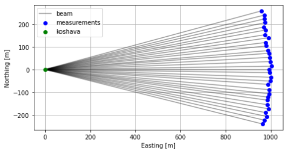

# Overview

`mocalum` is a python package for Monte Carlo based lidar uncertainty modeling. It has following features:

- Fast Monte Carlo uncertainty modeling
- Simulation of single or multi lidar configuration
- Configuration of arbitrary trajectories for single and multi lidars
- Configuration of [IVAP](https://journals.ametsoc.org/doi/10.1175/JTECH2047.1) (sector-scan) trajectory for single lidar
- 3D or 4D / uniform or turbulent flow field generation
- Sampling of correlated or uncorrelated uncertainty terms
- Built-in 2nd order kinematic model for calculation of trajectory timing
- 3D or 4D interpolation/projection of flow on lidar(s) line-of-sight(s)
- [xarray](http://xarray.pydata.org/en/stable/#) datasets enriched with metadata

## `mocalum` workflow

Typical `mocalum` workflow includes following steps (depict in the figure below):

1. Creating `mocalum` object
1. Adding lidar(s) and configuring uncertainty contributors to the object
2. Setting up measurement scenario for previously added lidar(s)
2. Sampling uncertainties
3. Generating flow field entailing measurement points
4. Project flow field on line-of-sight(s)
5. Reconstruct wind vector(s)
6. Perform statistical analysis of reconstructed wind vectors


**Figure 1.** `mocalum` workflow

### `mocalum` object
`mocalum` is developed considering [object-oriented paradigm](https://realpython.com/python3-object-oriented-programming/). Therefore, all calculations and access to generated data are through an instance of `mocalum` object on which various methods are applied. Once an instance of `mocalum` object is created users have access to following methods:

- `add_lidar`
- `generate_complex_trajectory`
- `generate_PPI_scan`
- `generate_uncertainties`
- `generate_flow_field`
- `project_to_los`
- `reconstruct_wind`

as well to `data` that will be created as a result of applying the above listed methods.

### Adding lidar

`add_lidar` method is used to add lidar(s) to the `mocalum` object instance. This method requires following input parameters:

- `id` of lidar
- `lidar position` as `numpy` array of triplets (x, y, z)
- `uncertainty dictionary` containing configuration of uncertainty contributors

The `uncertainty dictionary` contains values as standard uncertainties of each contributor to the total wind reconstruction uncertainty. The uncertainty contributors are:

- estimation uncertainty of radial velocity (in m/s)
- ranging uncertainty (in m)
- azimuth uncertainty (in deg)
- elevation uncertainty (in deg)

The uncertainty contributors are in more details described in [Uncertainty model for dual-Doppler retrievals of wind speed and wind direction](https://www.overleaf.com/project/5d26f91c09b8aa33a4702c4e).

Here is an example on how a `mocalum` object is created, and then a lidar named `koshava` added to the object:

```
import numpy as np
import mocalum as mc

mc_test = mc.Mocalum()

lidar_pos = np.array([0,0,0])

unc_cfg = {'unc_az'   : 0.1, # standard uncertainty for azimuth in deg
           'unc_el'   : 0.1, # standard uncertainty for elevation in deg
           'unc_rng'  : 5,   # standard uncertainty for ranging in m
           'unc_est'  : 0.1, # standard uncertainty for radial velocity estimation in m/s
           'corr_coef':0}    # correlation coefficient

mc_test.add_lidar('koshava', lidar_pos, unc_cfg)
```

One can access the underlying data that have been created by adding a lidar to the mocalum `object` by simply accessing the measurement configuration dictionary stored inside `data` sub-object:

```
mc_test.data.meas_cfg['koshava']
```

which returns:

```
{'position': array([0, 0, 0]),
 'uncertainty': {'unc_az': {'mu': 0, 'std': 0.1, 'units': 'deg'},
  'unc_el': {'mu': 0, 'std': 0.1, 'units': 'deg'},
  'unc_rng': {'mu': 0, 'std': 5, 'units': 'm'},
  'unc_est': {'mu': 0, 'std': 0.1, 'units': 'm.s^-1'},
  'corr_coef': 0},
 'config': {}}
```


### Setting up measurement scenario

Following the lidar placement and uncertainty configuration an user configures the measurement scenario which lidar will 'virtually' perform. Two methods are available to this, either the user can configure `PPI` or complex trajectory scans, using methods `generate_PPI_scan` and `generate_complex_trajectory` respectively.

`generate_PPI_scan` method requires following input parameters:

- lidar id for which the PPI scan is configured
- PPI scan dictionary containing following required parameters:

    - `sector_size` : size of the scanned sector in degrees
    - `azimuth_mid` : central azimuth angle of the PPI scanned arc
    - `angular_step` : Incremental step performed to complete a PPI scan
    - `acq_time` : acquisition time to complete an angular step, thus acquire LOS measurements
    - `elevation` : elevation angle of PPI scan
    - `range` : range at which measurements should take place
    - `no_scans` : number of PPI scans must be equal or bigger than 1

while following parameters are optional:

- `max_speed` : maximum permitted angular speed
- `max_acc` : maximum permitted angular acceleration


Similarly, `generate_complex_trajectory` method requires following parameters:

- lidar ids provided as a list of strings for which the complex trajectory will be generated
- Scan configuration as a dictionary containing with following key-value pairs:

    - `points` : `numpy` array of measurement points provided as triplets of coordinates (x, y, z)
    - `no_scans` : number of scans through the points
    - `acq_time` : acquisition time of LOS measurements

while following parameters are optional:

- `max_speed` : max permitted angular speed
- `max_acc` : max permitted angular acceleration
- `sync` : indicates whether to synchronize ('sync':True) or not ('sync':False) motion among multiple lidars

Here is an example on how a `PPI` scan is configure and assigned to the lidar `koshava`:
```
meas_height = 100 # in m
meas_range = 1000 # in m
PPI_cfg = {
    'no_scans' : 10000,
    'range' : meas_range,
    'elevation' : np.degrees(np.arcsin(meas_height / meas_range)), # to assure measurements at 100 m agl
    'angular_step' : 1,  # in deg
    'acq_time' : 1,      # in s
    'azimuth_mid' : 90,  # central azimuth angle in deg
    'sector_size' : 30,  # deg
}

mc_test.generate_PPI_scan('koshava', PPI_cfg)

```

In the above example we configured `koshava` to peform PPI scans of 30 degrees centered at the azimuth angle of 90 degrees at the range of 1 km over 100 m the above ground level. The lidar will perform 10000 virtual `PPI` scans. In this example we omitted supplying any information on kinematic limits of the scanner head. By 'attaching' measurement scenario to the lidar the aforementioned measurement configuration dictionary becomes updated:

```
{'position': array([0, 0, 0]),
 'uncertainty': {'unc_az': {'mu': 0, 'std': 0.1, 'units': 'deg'},
  'unc_el': {'mu': 0, 'std': 0.1, 'units': 'deg'},
  'unc_rng': {'mu': 0, 'std': 5, 'units': 'm'},
  'unc_est': {'mu': 0, 'std': 0.1, 'units': 'm.s^-1'},
  'corr_coef': 0},
 'config': {'scan_type': 'PPI',
  'max_scn_speed': 50,
  'max_scn_acc': 100,
  'scn_speed': 1.0,
  'no_los': 30,
  'no_scans': 10000,
  'sectrsz': 30,
  'scn_tm': 30.0,
  'rtn_tm': 0,
  'az': array([ 75.,  76.,  77.,  78.,  79.,  80.,  81.,  82.,  83.,  84.,  85.,
          86.,  87.,  88.,  89.,  90.,  91.,  92.,  93.,  94.,  95.,  96.,
          97.,  98.,  99., 100., 101., 102., 103., 104.]),
  'el': array([5.73917048, 5.73917048, 5.73917048, 5.73917048, 5.73917048,
         5.73917048, 5.73917048, 5.73917048, 5.73917048, 5.73917048,
         5.73917048, 5.73917048, 5.73917048, 5.73917048, 5.73917048,
         5.73917048, 5.73917048, 5.73917048, 5.73917048, 5.73917048,
         5.73917048, 5.73917048, 5.73917048, 5.73917048, 5.73917048,
         5.73917048, 5.73917048, 5.73917048, 5.73917048, 5.73917048]),
  'rng': array([1000., 1000., 1000., 1000., 1000., 1000., 1000., 1000., 1000.,
         1000., 1000., 1000., 1000., 1000., 1000., 1000., 1000., 1000.,
         1000., 1000., 1000., 1000., 1000., 1000., 1000., 1000., 1000.,
         1000., 1000., 1000.])}}
```


Besides the update of the measurement configuration dictionary, a probing [xarray dataset](http://xarray.pydata.org/en/stable/data-structures.html#dataset) was created in this step in the background which fused all information together. It is accessible using the following command:

```
mc_test.data.probing['koshava']
```

Visually our measurement scenario is shown in the figure below.



**Figure 2.** Lidar `koshava` performing a virtual `PPI` scan.


### Sampling uncertainties
At this point in the workflow we have added a lidar to the `mocalum` object and configure it to perform virtual measurement scenario. Even though we described the lidar with values of the standard deviation of each uncertainty contributor we still did not actually 'inject' the uncertainties in our measurement scenario. To this, and basically sample uncertainties we need to execute the method `generate_uncertainties`:

```
mc_test.generate_uncertainties('koshava')
```

If we now visually represent the measurement scenario (see Figure 3) we can notice that the previously perfect arc scan (Figure 2) became 'crooked' because the uncertainties in the laser beam positioning have been injected.



**Figure 2.** Lidar `koshava` performing a virtual `PPI` scan.


### Generating flow field

### Wind reconstruction
### Uncertainty analysis