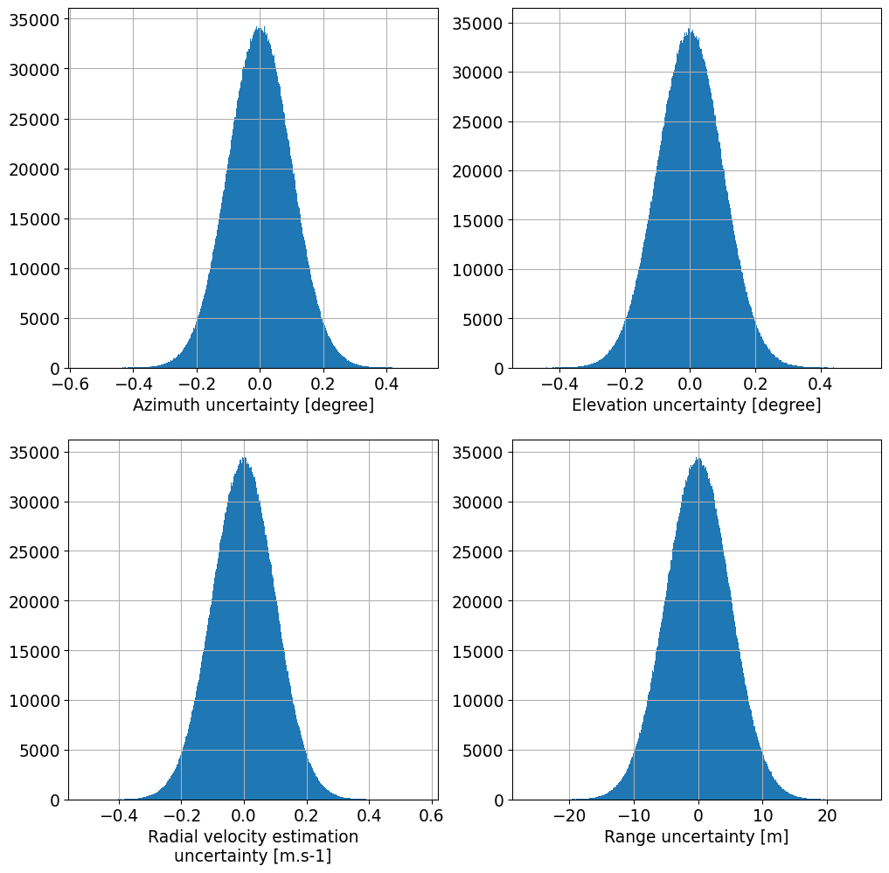
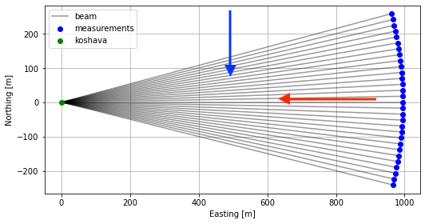

# Introduction

In this section we will calculate wind speed uncertainty of a single-Doppler setup by means of Monte-Carlo simulations. We will consider a sector-scanning lidar performing a PPI scan. The size of the PPI scan and wind direction will vary. Nevertheless, the range, and thus the elevation angle of the PPI scan, as well the central azimuth angle will be kept fixed.

We will consider two cases in which the uncertainties are correlated or uncorrelated between line of sights (LOS) of the PPI scans respectively. The obtained results will be collected and presented as plots which will show dependency of the wind speed uncertainty with respect to the size of the scanned sector, wind direction and correlation coefficient. The range, and thus elevation angle of the PPI scan will be kept fixed.

# Simulation configuration

Lets consider a lidar which we will call `koshava`, located at position of (0,0,0). `koshava` will perform 189000 virtual PPI scans, which central azimuth angle will be 90 degrees, thus pointing towards East. The measurement range will be fixed at 1000 m. The beam elevation angle will be such that at 1000 m range the beam will be positioned at 100 m above the ground level. Accordingly, the elevation angle will be fixed to 5.74 degree from zenith. We will vary the PPI sector size in increments of 10 degrees starting at 10 degrees and finishing at 100 degrees. The angular step of the PPI scan will be set to 1 degree, which will be accomplished within the time of 1 s (the acquisition time of LOS measurements). `koshava` will have following values for uncertainty contributors (standard uncertainty):
- estimation uncertainty of radial velocity of 0.1 m/s
- ranging uncertainty of 5 m
- azimuth uncertainty of 0.1 deg
- elevation uncertainty of 0.1 deg

Figure 7 depicts histograms of sampled uncertainty contributors of a PPI scan of 30 degrees for all LOSs and for all 189000 scans. As expected the histograms exhibit normal distributions with mean in zero and standard deviations equal to the above listed values.

**Figure 7.** Distribution of sampled and injected uncertainties to probing dataset

The atmosphere in which the virtual PPI scans will be performed will be turbulent. Nevertheless, the mean wind speed will be set to 10 m/s at the reference height of 100 m above the ground level, while the shear exponent has value of 0.2. We are considering two wind directions, 0 degrees (the wind coming from the North being perpendicular to the central azimuth angle of the PPI scans) and 90 degrees (the wind coming from the East being in-line with the central azimuth angle of the PPI scans). These two wind direction scenarios are depicted in Figure 8.

**Figure 8.** Two wind direction scenarios: (1) wind coming from North - blue arrow and (2) wind coming from East - red arrow

This configuration is provided as an interactive jupyter-notebook denoted [tutorial 4](https://github.com/niva83/mocalum/tree/master/examples) in `mocalum` git repository.

# Results of simulations
