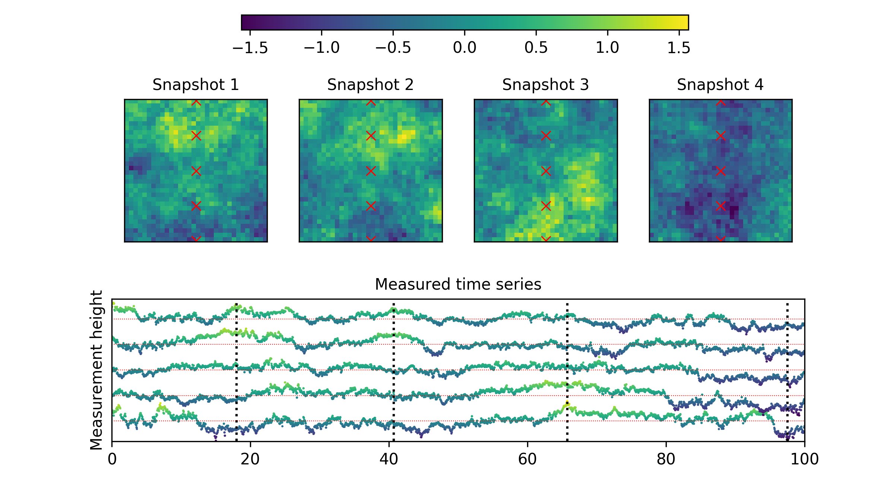

.. PyConTurb documentation master file

Welcome to PyConTurb
===========================================

*- An open-source, constrained-turbulence generator for loads validation.*

**Quick links:** :ref:`installation`, :ref:`Get started <overview>`, :ref:`Reporting bugs <overview>`,
`Source code <https://gitlab.windenergy.dtu.dk/pyconturb/pyconturb>`_.

The image above shows an example of a turbulence box that has been simulated
from five measured time series. This sort of constrained turbulence simulation
is particularly useful during wind-turbine loads validation, when it is
important to adequately characterize the inflow in order to validate an
aeroelastic model.

PyConTurb is a package that can be used to generate turbulence boxes that
are constrained on measurements. The type of constraint is flexible, whether
it be a spatially varying mean or standard deviation or whether it is
constrained directly to a time series. To get started, follow the instructions
in the :ref:`installation` section, check out the :ref:`overview` and then look
at :ref:`examples`.

The source code is located
`here on GitLab <https://gitlab.windenergy.dtu.dk/pyconturb/pyconturb>`_.

Contents:
    .. toctree::
        :maxdepth: 2
    
        installation
        overview
        reference_guide
        examples